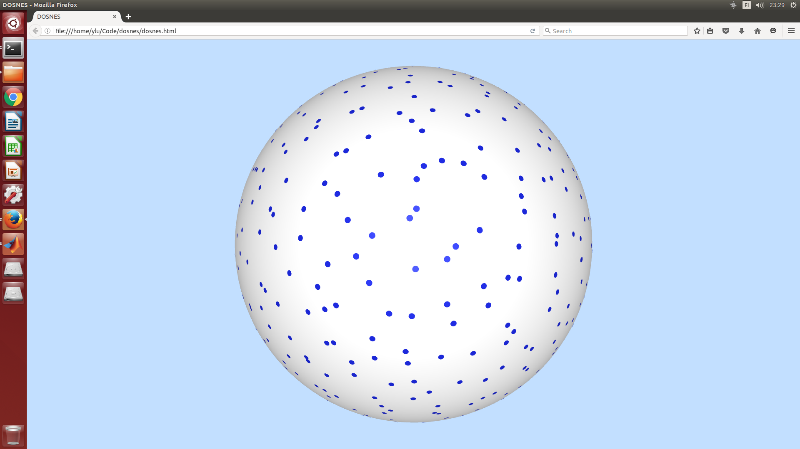

#Doubly Stochastic Neighbor Embedding on Spheres
DOSNES is a new method to visualize your data.

##Project Page
http://yaolubrain.github.io/dosnes/

##Paper
[Doubly Stochastic Neighbor Embedding on Spheres] (https://github.com/yaolubrain/DOSNES) <br>
Yao Lu\*, Zhirong Yang\*, Jukka Corander <br>
(*equal contribution)

##How to use?
Here is a simple example. 
``` 
% Generate data and its similarity matrix
X = randn(1000, 10);
X = bsxfun(@minus, X, mean(X));
D = pdist2(X,X,'squaredeuclidean');
P = exp(-D);

% Normalize the similarity matrix to be doubly stochastic by Sinkhorn-Knopp method
for i = 1:100
    P = bsxfun(@rdivide, P, sum(P,1));
    P = bsxfun(@rdivide, P, sum(P,2));
end    

% Run t-SNE with the spherical constraint
Y = tsne_p_sphere(P);

% Normalize Y to have unity radius for visualization
Y = bsxfun(@rdivide, Y, sqrt(sum(Y.^2, 2)));

% Save the data 
dosnes_data = [Y ones(length(Y),1) 5*ones(length(Y),1)];
csvwrite('data.csv', dosnes_data);
``` 

Now open `dosnes.html` with Firefox. Don't use Chrome. You will have the interactive visualization in your browser.



For examples of more features, please see the `demo` folder.

